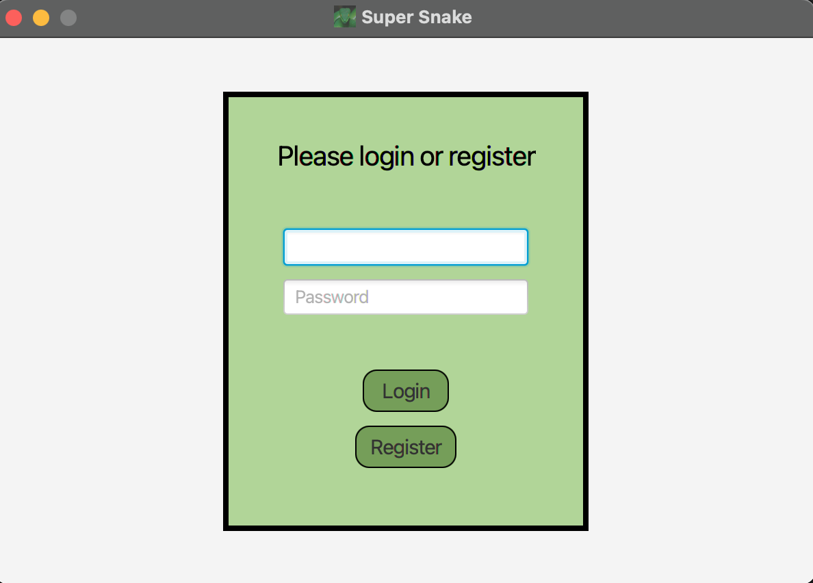
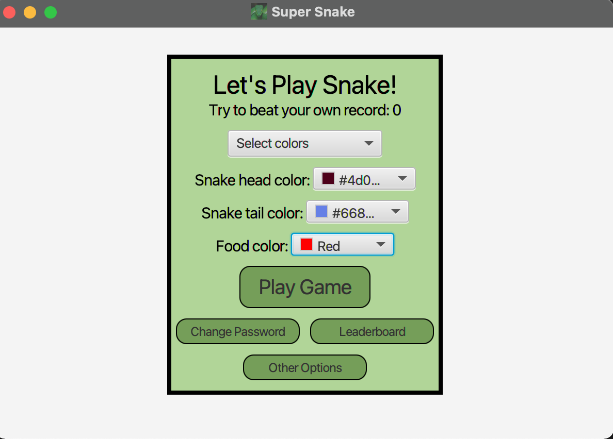
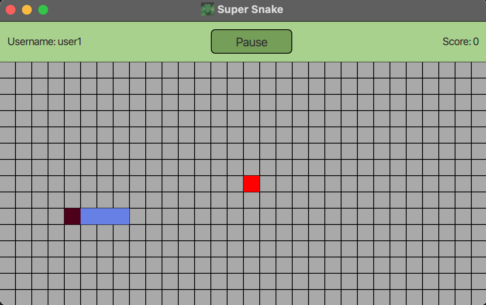
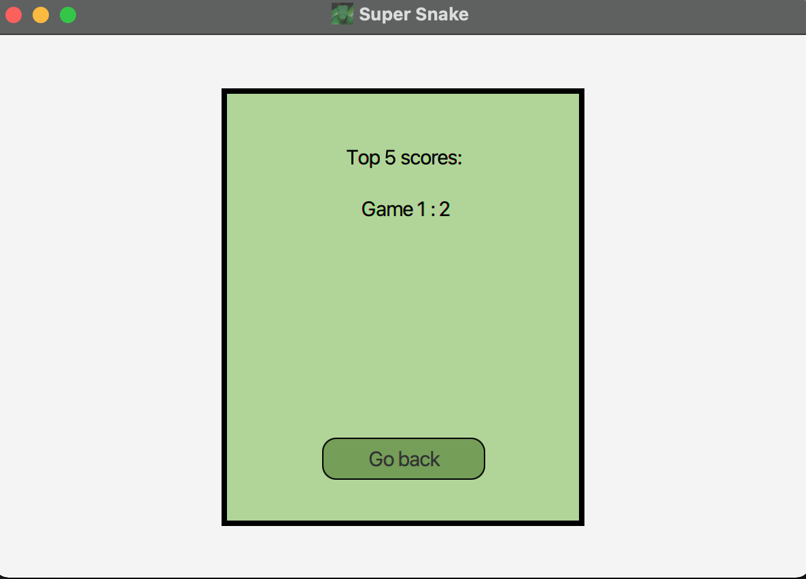

# To run the game you need:
- java 17
- javafx 17.0.2
- gradle 7.4.1
- run vm with options for javafx `--module-path /Users/<user>/Downloads/javafx-sdk-17.0.2/lib --add-modules javafx.controls,javafx.fxml`
- run Main class

# Screenshots:

Login screen:

User screen:

Game screen:

Leaderboard:

